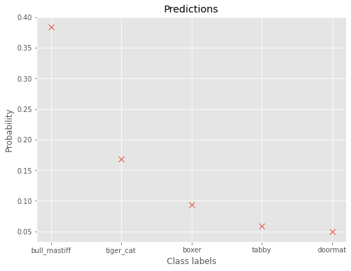
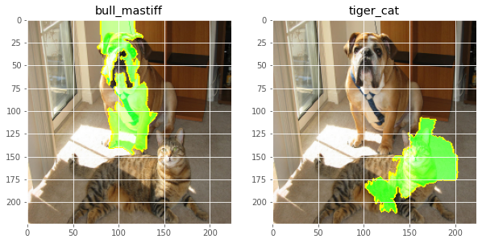
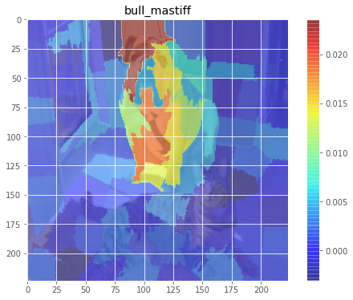
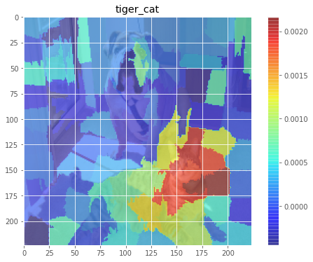

# LIME
Notebook for using LIME(Local Interpretable Model-agnostic Explanations) in python.
## _A notebook for LIME in python_

## Main Idea
LIME, is a technique that approximates any black box machine learning model with a local, interpretable model to explain each individual prediction.

The idea stems from a [2016 paper](https://arxiv.org/pdf/1602.04938.pdf) in which the authors perturb the original data points, feed them into the black box model, and then observe the corresponding outputs. The method then weighs those new data points as a function of their proximity to the original point. Ultimately, it fits a surrogate model such as linear regression on the dataset with variations using those sample weights. Each original data point can then be explained with the newly trained explanation model.

## Formulation
LIME rests upon following equation whcih measures how unfaithful model $g$ approximates the model-to-be-explained $f$ in its vicinity $\pi_x$.


## Objective
This notebook aims to provide a basic demostration on how to the compute and perform LIME analysis on image classification. 

# Enviornment
* Ubuntu 18.04 (WSL) 
* Python3.6
* pytorch 1.7.0

## Setup
Run the following command to setup the virtual enviornment
```sh
sudo source setup.sh
```

## LIME analysis
### 1. Input Image


### 2. Model: 
Resnet50

### 3. Model Predictions



### 4. Objective Explanations



### 5. Objective Explanations with weight

 
